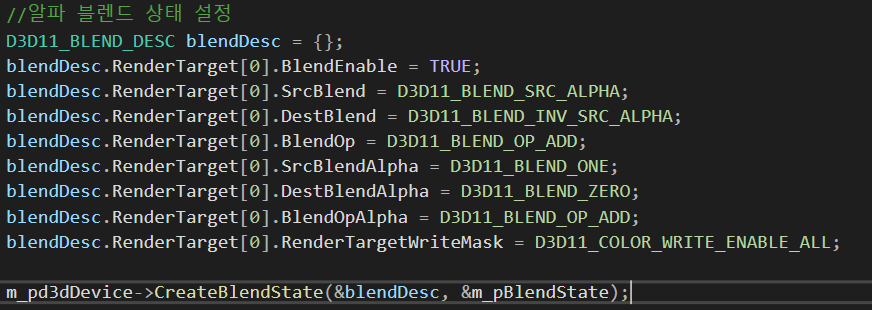
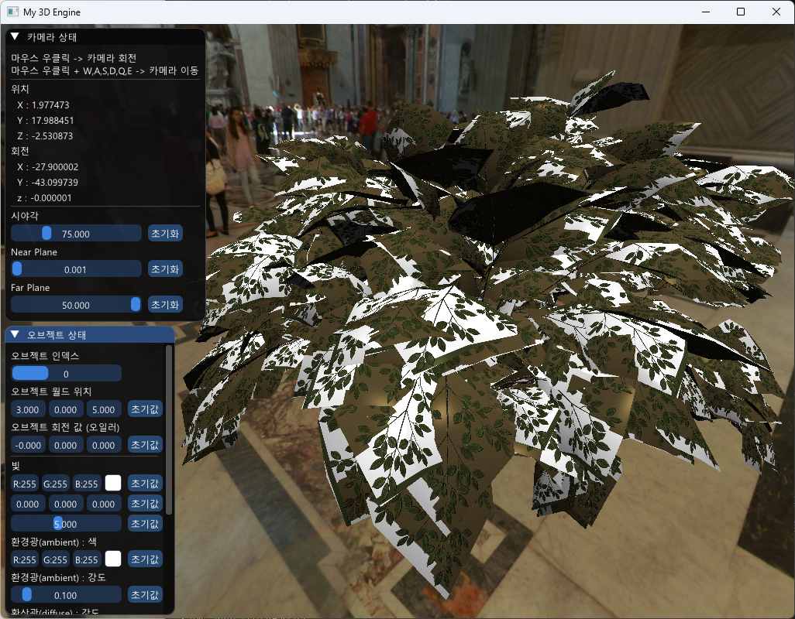
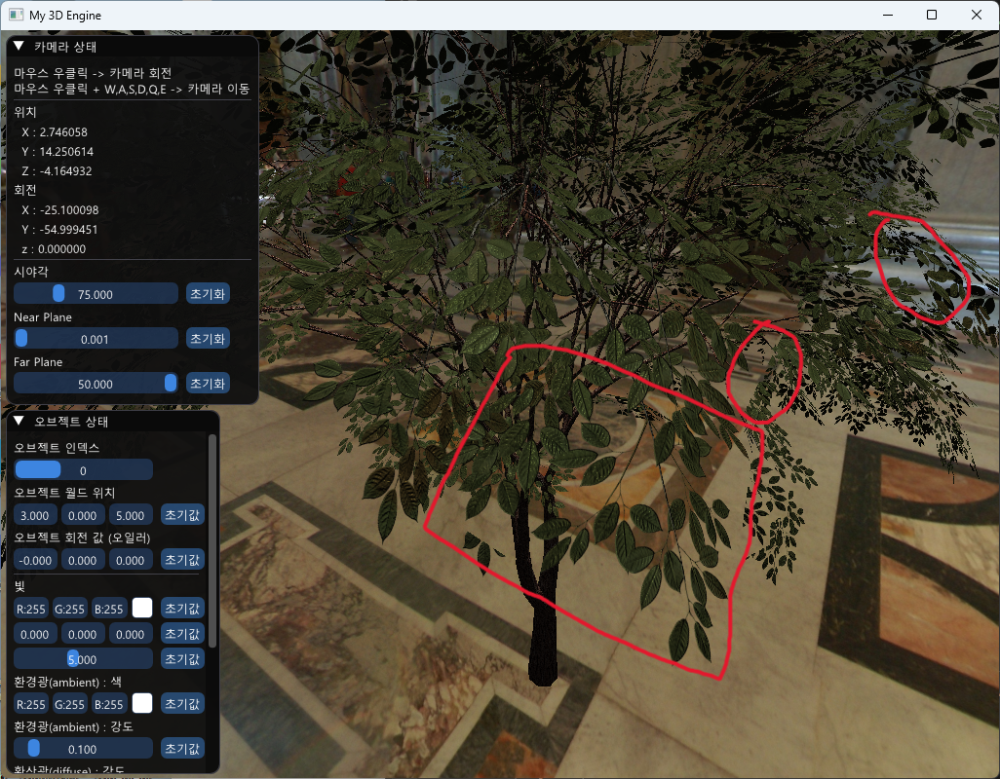
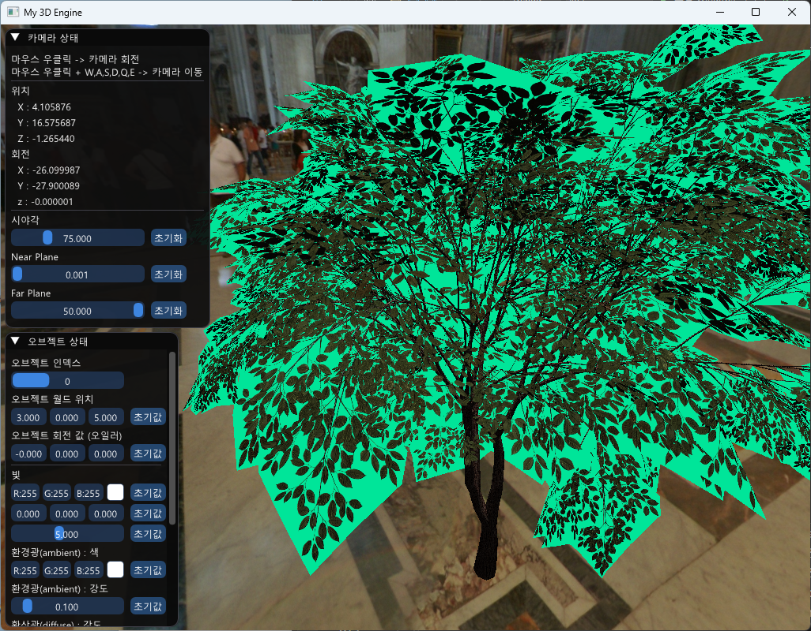

# Alpha Blend Artifact

- 알파 블렌딩을 허용하는 경우 생기는 아티팩트에 대해 알아보자.

## 알파 블렌딩 상태 정의

- 투명 텍스쳐를 표현하기 위해 다음과 같은 작업이 필요하다.

- 설정하지 않은 경우 다음과 같은 아티팩트가 나타난다
  

## 알파 블렌딩만 활성화하는 경우

- 알파 블렌딩을 활성화하고 그대로 그리게 되면 메쉬 위의 알파가 0인 픽셀도 z-buffer에 기록되기 때문에 색깔을 지워버리면서 위와 같은 아티팩트가 일어난다.

## 알파클립핑

- 기대하는 알파값(0.5f 이상)보다 현재 픽셀의 알파가 낮은 경우 아예 픽셀을 그리지 않도록 하여 올바른 그림이 나오도록 유도한다.

